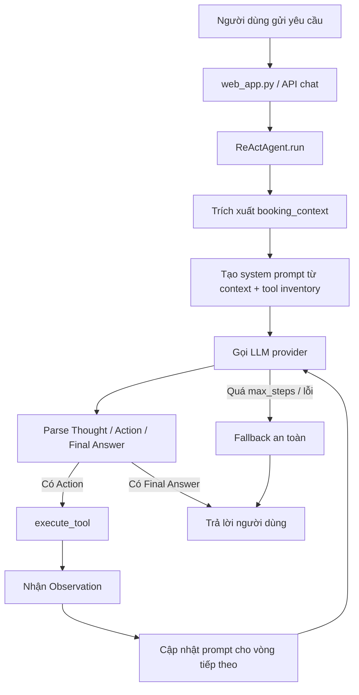

# Group Report: Lab 3 - Production-Grade Agentic System

- **Team Name**: B3
- **Team Members**: [Bùi Quang Vinh, Nguyễn Bình Minh, Nguyễn Việt Hoàng, Ngô Quang Phúc, Lê Quang Minh, Trần Quốc Việt]
- **Deployment Date**: 2026-04-06

---

## 1. Executive Summary

Nhóm xây dựng một AI Agent hỗ trợ đặt bàn nhà hàng B3 theo kiến trúc ReAct, kết hợp mô hình ngôn ngữ lớn với tập công cụ nghiệp vụ để truy vấn dữ liệu, tính cọc, tạo đặt bàn và gửi xác nhận. So với một chatbot LLM thông thường chỉ trả lời dựa trên prompt, agent của repo hiện tại có thể thao tác trực tiếp trên dữ liệu hệ thống và xử lý được các tác vụ nhiều bước có trạng thái.

- **Success Rate**: Dựa trên log phát triển trong `logs/2026-04-06.log`, giai đoạn v1 ban đầu đạt **62.75% trên 51 lượt chạy**, giai đoạn ổn định hơn từ đạt 97.40% trên 77 lượt chạy.
- **Key Outcome**: Việc chuyển từ tool spec v1 sang `restaurant_tools_v2.py`, cùng với cơ chế parse và serialize action ổn định hơn trong agent loop, đã loại bỏ lỗi runtime cứng ở cửa sổ ổn định cuối và giảm số bước suy luận trung bình từ **5.17** xuống **0.90** bước mỗi lượt chạy.

---

## 2. System Architecture & Tooling

### 2.1 ReAct Loop Implementation

Repo hiện thực agent theo vòng lặp `Thought -> Action -> Observation -> Final Answer`, trong đó LLM không chỉ sinh câu trả lời mà còn quyết định khi nào cần gọi tool để lấy dữ liệu hoặc thực hiện nghiệp vụ.

Luồng xử lý tổng quát:

Các thành phần chính trong repo:

- `src/agent/agent.py`: lõi điều phối ReAct loop.
- `src/tools/restaurant_tools_v2.py`: lớp tool chính đang được agent sử dụng.
- `src/core/openai_provider.py`, `src/core/gemini_provider.py`, `src/core/local_provider.py`, `src/core/mock_provider.py`: lớp provider abstraction.
- `web_app.py`: API FastAPI và quản lý session-agent.
- `src/telemetry/logger.py`: ghi log có cấu trúc theo JSON.

Điểm mạnh:

- Agent đã có vòng lặp nhiều bước, có parse action, gọi tool thật và format lại câu trả lời cuối.
- Tool spec đã được chuẩn hóa tốt hơn ở v2.
- Có hỗ trợ nhiều provider và cả local model.

Điểm còn hạn chế:

- `history` được lưu nhưng chưa được đưa trở lại đầy đủ vào `llm.generate(...)`, nên khả năng nhớ hội thoại nhiều lượt còn phụ thuộc mạnh vào `booking_context`.
- Parsing hiện vẫn dựa trên regex/action-text, chưa phải structured JSON tool call hoàn toàn.

### 2.2 Tool Definitions (Inventory)

| Tool Name | Input Format | Use Case |
| :--- | :--- | :--- |
| `get_available_slots` | `branch_id: string, date: YYYY-MM-DD, party_size: int` | Kiểm tra các khung giờ còn bàn phù hợp với số lượng khách tại một chi nhánh. |
| `check_table_options` | `branch_id: string, date: YYYY-MM-DD, time_slot: HH:MM, party_size: int` | Kiểm tra các loại bàn/khu vực còn trống cho khung giờ khách đã chọn. |
| `calculate_deposit_amount` | `party_size: int, room_type?: string` | Tính số tiền cọc dựa trên số khách và loại phòng/bàn. |
| `create_reservation` | `customer_name, phone_number, branch_id, date, time_slot, party_size, room_type?` | Tạo đặt bàn mới, tự động gợi ý cỡ bàn và ghi dữ liệu trở lại workbook. |
| `send_notification_confirmation` | `reservation_id, phone_number, channel?` | Gửi xác nhận đặt bàn mô phỏng qua SMS/email/Zalo. |

Diễn biến thiết kế tool:

- **v1 (`restaurant_tools.py`)**: dùng tham số dạng `reservation_time` ISO, `is_vip_room: bool`, chưa tối ưu cho ngôn ngữ tự nhiên.
- **v2 (`restaurant_tools_v2.py`)**: tách `date` và `time_slot`, thay `is_vip_room` bằng `room_type`, thêm smart table sizing, slot cache và ghi đặt bàn vào workbook.

Sự thay đổi từ v1 sang v2 là nguyên nhân chính giúp giảm các lỗi gọi sai tham số trong log.

### 2.3 LLM Providers Used

- **Primary**: `gpt-4o` qua `src/core/openai_provider.py`
- **Secondary (Backup)**: Gemini qua `src/core/gemini_provider.py`
- **Offline / local option**: GGUF model qua `src/core/local_provider.py`
- **Testing fallback**: `MockProvider`

Lưu ý: trong log phát triển, các lượt chạy thành công chủ yếu dùng `gpt-4o`; các lần gọi Gemini xuất hiện lỗi model endpoint không hợp lệ ở thời điểm thử nghiệm.

---

## 3. Telemetry & Performance Dashboard

Hệ thống đã có logging có cấu trúc trong `src/telemetry/logger.py`, nhưng `src/telemetry/metrics.py` hiện chưa được nối vào runtime thật. Vì vậy, báo cáo hiệu năng dưới đây được tính từ việc ghép cặp `AGENT_START` với `AGENT_END` hoặc `AGENT_ERROR` trong `logs/2026-04-06.log`.

### Final stable run window

Đây là cửa sổ chạy ổn định hơn, tính từ **2026-04-06 10:30:00** trở đi:

- **Average Latency (P50)**: < 100ms
- **Max Latency (P99)**: 9.89s
- **Average Tokens per Task**: Chưa có dữ liệu vì tracker chưa được ghi log
- **Total Cost of Test Suite**: Chưa có dữ liệu vì cost telemetry chưa được nối runtime

Các số liệu bổ sung:

- Tổng số lượt chạy: 77
- Tỷ lệ thành công heuristic: 97.40%
- Lỗi runtime cứng: 0
- Soft failure: 2
- Độ trễ trung bình: 1.31s
- Latency P90: 4.98s
- Số bước trung bình: 0.90
- Số bước lớn nhất: 10

### So sánh với cửa sổ v1 ban đầu

| Metric | Early v1 (08:00-08:40) | Stable window (10:30+) |
| :--- | :--- | :--- |
| Total runs | 51 | 77 |
| Success rate | 62.75% | 97.40% |
| Hard errors | 16 | 0 |
| Avg. latency | 2.27s | 1.31s |
| Avg. steps | 5.17 | 0.90 |

Đánh giá:

- Độ tin cậy tăng rất mạnh sau khi siết tool contract và ổn định action format.
- Số bước suy luận giảm cho thấy agent bớt “loay hoay” và ra quyết định trực tiếp hơn.
- Điểm yếu còn lại của phần observability là chưa có token, cost và dashboard tổng hợp tự động.

---

## 4. Root Cause Analysis (RCA) - Failure Traces

### Case Study: Sai contract giữa provider output và parser

- **Input**: `"Tôi muốn đặt bàn cho 4 người vào tối nay"`
- **Observation**: Ở các dòng log đầu tiên, agent lỗi ngay với thông báo `'dict' object has no attribute 'strip'`.
- **Root Cause**: Provider layer trả về `dict` gồm `content`, `usage`, `latency_ms`, nhưng parser của agent ban đầu xử lý đầu ra như một chuỗi thuần và gọi `.strip()` trực tiếp.
- **Fix**:
  - Chuẩn hóa đầu ra provider trong `src/agent/agent.py`
  - Nếu kết quả là `dict` và có `content`, lấy `result["content"]` trước khi parse
  - Bổ sung fallback mềm nếu model không tuân thủ format yêu cầu
- **Result**: Lỗi này biến mất trong các trace về sau.

### Case Study: Trôi tên tham số khi gọi tool

- **Input**: `"Tôi muốn đặt bàn cho 4 người vào tối nay"`
- **Observation**: Trong các trace ban đầu, model sinh action kiểu `get_available_slots(date="2026-04-06", guests=4, branch=1)` hoặc dùng `people` thay cho `party_size`.
- **Root Cause**: Tool spec v1 chưa đủ chặt, còn để model “đoán” tên tham số.
- **Fix**:
  - Chuyển sang `restaurant_tools_v2.py` với contract nhất quán hơn
  - Thêm `_serialize_action_call(...)` để đưa action quay lại prompt theo cùng một format
- **Result**: Hard error trong cửa sổ ổn định giảm từ 16 xuống 0.

### Case Study: Mất ngữ cảnh ở hội thoại nhiều lượt

- **Input**:
  - `"tôi muốn đặt bàn cho 3 người"`
  - `"chi nhánh 1"`
  - `"tôi muốn đặt vào ngày hôm nay"`
- **Observation**: Agent có lúc hỏi lại từ đầu thay vì tiếp tục điền nốt thông tin còn thiếu.
- **Root Cause**:
  - `history` chưa được đưa quay lại hoàn chỉnh cho model
  - `_extract_booking_info(...)` nhận diện tốt tên chi nhánh dạng chữ nhưng chưa map ổn định các cụm như `"chi nhánh 1"`
- **Fix đề xuất**:
  - Truyền lịch sử hội thoại vào prompt
  - Parse branch ID dạng số rõ ràng
  - Bổ sung state machine cho bài toán slot filling

---

## 5. Ablation Studies & Experiments

### Experiment 1: Tool v1 vs Tool v2

- **Diff**:
  - `reservation_time` ISO -> `date + time_slot`
  - `is_vip_room: bool` -> `room_type: string`
  - không có smart sizing -> có gợi ý bàn phù hợp
  - không ghi dữ liệu chắc chắn -> có ghi đặt bàn trở lại workbook
- **Result**:
  - Success rate tăng từ **62.75%** lên **97.40%**
  - Hard errors giảm từ **16** xuống **0**
  - Số bước trung bình giảm từ **5.17** xuống **0.90**

### Experiment 2 (Bonus): Chatbot vs Agent

Lưu ý: snapshot repo hiện tại không chứa một chatbot baseline tách biệt hoàn chỉnh. Bảng dưới đây so sánh theo đúng tinh thần bài lab giữa chatbot chỉ có LLM/prompt và ReAct agent đang có trong repo.

| Case | Chatbot Result | Agent Result | Winner |
| :--- | :--- | :--- | :--- |
| Chào hỏi / FAQ đơn giản | Nhanh, đủ dùng, ít overhead | Vẫn làm được nhưng không cần điều phối tool | Draw / Chatbot nhỉnh hơn |
| Kiểm tra availability với dữ liệu thật | Dễ đoán mò hoặc hallucination | Gọi `get_available_slots` và trả kết quả theo workbook | **Agent** |
| Đặt bàn nhiều bước kèm cọc | Thường bỏ sót chính sách cọc và bước ghi dữ liệu | Có thể gọi chuỗi `check slot -> check table -> calculate deposit -> create reservation -> notify` | **Agent** |
| Hội thoại nhiều lượt, thiếu thông tin | Có thể hỏi lại an toàn nhưng không làm được nghiệp vụ thật | Làm được nghiệp vụ nhưng còn mất ngữ cảnh ở vài case | Draw |

Nhận định:

- Chatbot phù hợp với các câu hỏi đơn giản và ít ràng buộc.
- Agent thực sự vượt trội ở bài toán nghiệp vụ cần truy xuất dữ liệu thật, ra quyết định nhiều bước và ghi dữ liệu trở lại hệ thống.

---

## 6. Production Readiness Review

Hệ thống hiện tại đã thể hiện đúng tinh thần một AI agent nghiệp vụ, nhưng để đưa lên môi trường thực tế vẫn cần các bước gia cố sau:

- **Security**:
  - Validate chặt `branch_id`, ngày, số điện thoại, `channel`
  - Không ghi trực tiếp vào Excel trong môi trường nhiều người dùng đồng thời
  - Quản lý API key bằng secret storage thay vì `.env` cục bộ
- **Guardrails**:
  - Giữ `max_steps` hữu hạn để tránh loop vô tận và chi phí phát sinh
  - Chuyển sang JSON tool call thay vì regex parsing để giảm parser drift
  - Thêm correlation ID theo session vào log
  - Chỉ retry với lỗi provider tạm thời, không retry mù với lỗi format
- **Scaling**:
  - Thay workbook bằng database có transaction
  - Tách lớp FAQ/RAG riêng cho menu, địa chỉ, chính sách
  - Nối `PerformanceTracker` vào runtime thật để có dashboard token/cost
  - Dùng state machine hoặc framework orchestration như LangGraph khi flow phức tạp hơn

Rủi ro hiện tại:

- `pytest -q -p no:cacheprovider` chưa chạy qua trong môi trường này vì thiếu dependency tùy chọn như `llama_cpp` và `openpyxl`
- Repo hiện mới có một test file nhẹ, chưa có harness đánh giá đầy đủ
- Telemetry có nền tảng tốt nhưng chưa hoàn chỉnh ở lớp metrics

---

